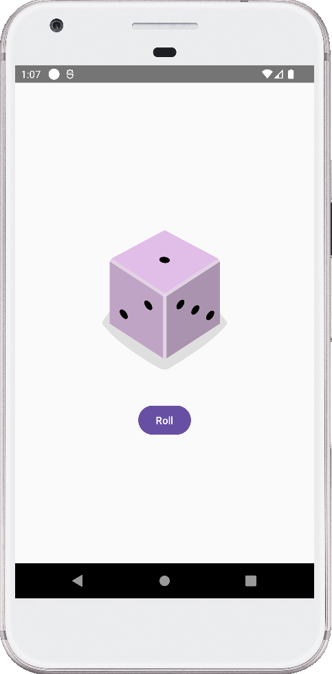

# kotlin-dice-roller
**[STUDY]** Practice guided by Google CodeLabs.
**Summary**
* Define composition functions.
* Create layouts with compositions.
* Create a button with the Button composable element.
* Import drawable resources.
* Show an image with the Image composable element.
* Use composable elements to make an interactive interface.
* Use the remember composable element to store objects in a composition in memory.
* Update an interface with the mutableStateOf() function to create an observable element.

## See also
For more information, check out the [Google CodeLabs](https://codelabs.developers.google.com/).